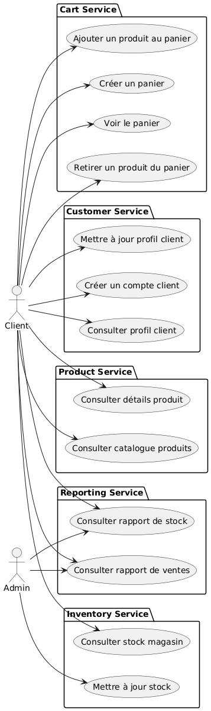
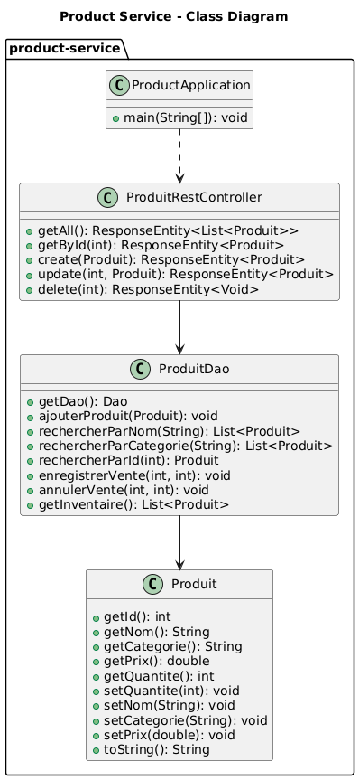
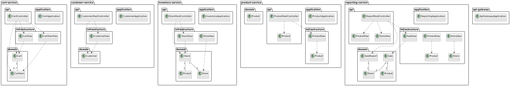
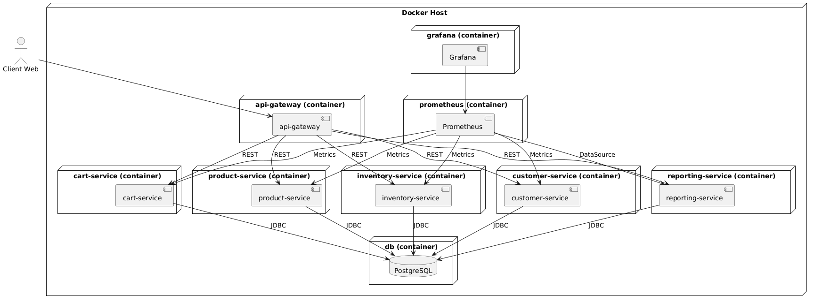

# Rapport d’architecture (Arc42) – LAB5 Microservices

## 1. Introduction et objectifs
Ce projet vise à fournir une architecture microservices simple pour la gestion d’un magasin (produits, inventaire, commandes, clients, reporting). L’objectif est la simplicité, la maintenabilité et la scalabilité, tout en facilitant le monitoring et l’intégration continue.

## 2. Contraintes
- Utilisation de Java 21 et Spring Boot 3.x
- Base de données PostgreSQL (partagée entre tous les microservices)
- Conteneurisation via Docker
- Monitoring avec Prometheus et Grafana
- Documentation API avec OpenAPI/Swagger
- ORMLite pour la persistance

## 3. Vue contextuelle

*Figure 1 : Vue contextuelle du projet*

Le système est composé de plusieurs microservices : product-service, inventory-service, order-service, customer-service, reporting-service, tous orchestrés derrière une API Gateway. Chaque service possède sa propre base de code et communique via HTTP/REST. **Tous les services partagent la même base de données PostgreSQL (magasin).**

## 4. Vue des solutions

*Figure 2 : Vue logique de l'architecture*

- **API Gateway** : Point d’entrée unique, gestion du routage, sécurité, documentation centralisée.
- **Microservices** : Chaque domaine métier (produit, inventaire, commande, client, reporting) est isolé dans un service indépendant.
- **Base de données** : **Unique instance PostgreSQL partagée entre tous les services.**
- **Monitoring** : Prometheus collecte les métriques exposées par Actuator, Grafana pour la visualisation.
- **Sécurité** : Spring Security (configurable, actuellement permissif pour simplifier les tests).
- **CI/CD** : Pipeline GitHub Actions pour lint, test, build, et déploiement Docker.

## 5. Vue d’implémentation

*Figure 3 : Vue d'implémentation des composants principaux*

## 6. Justification des choix
- **Simplicité** : Architecture microservices minimale, chaque service est autonome au niveau du code, mais **les données sont centralisées dans une base partagée** pour simplifier la gestion et l’intégration.
- **Interopérabilité** : Utilisation de standards (REST, OpenAPI, Docker).
- **Observabilité** : Intégration native de Prometheus et Grafana.
- **Extensibilité** : Ajout de nouveaux services ou endpoints facilité.
- **Base partagée** : Ce choix permet de simplifier le déploiement et la gestion des données, mais introduit un couplage entre les services au niveau de la base. Cela peut limiter l’indépendance des microservices, mais reste adapté à un contexte pédagogique ou à un projet de taille modérée.

## 7. Vue des déploiements

*Figure 4 : Vue de déploiement*

- Docker Compose orchestre les conteneurs : base de données, services, monitoring.
- Chaque service expose son port, l’API Gateway redirige les requêtes externes.

## 8. Vue des décisions architecturales (ADR)

### ADR-1 : Utilisation de Spring Cloud Gateway pour l’API Gateway
**Contexte** : Il faut un point d’entrée unique pour les clients, capable de router les requêtes vers les bons microservices, gérer la sécurité, la documentation, et éventuellement le load balancing.
**Décision** : Utiliser Spring Cloud Gateway, qui s’intègre naturellement avec Spring Boot, permet une configuration simple, et supporte les patterns courants (routing, filtrage, sécurité).
**Conséquences** : 
- Simplifie la configuration et l’évolution du routage.
- Permet d’ajouter facilement des filtres (auth, logs, etc.).
- S’intègre avec le monitoring et la documentation.

### ADR-2 : Utilisation d’ORMLite pour la persistance des données
**Contexte** : Chaque microservice doit accéder à une base de données relationnelle, mais on souhaite éviter la complexité de JPA/Hibernate pour rester simple et léger.
**Décision** : Utiliser ORMLite comme ORM, car il est simple à configurer, léger, et adapté à des besoins CRUD classiques.
**Conséquences** : 
- Réduit la courbe d’apprentissage et la configuration.
- Permet un mapping direct entre les entités Java et les tables SQL.
- Moins de fonctionnalités avancées que JPA, mais suffisant pour ce projet.

## 9. Vue des risques et dettes techniques
- Sécurité actuellement permissive (à renforcer en production).
- **Base de données partagée : risque de couplage entre services, à isoler si besoin dans une évolution future.**
- Monitoring et alerting à compléter selon les besoins réels.

## 10. Glossaire
- **API Gateway** : Point d’entrée unique pour les clients.
- **Microservice** : Service indépendant, responsable d’un domaine métier.
- **ORMLite** : ORM Java léger pour la persistance SQL.
- **Prometheus/Grafana** : Outils de monitoring et visualisation. 

